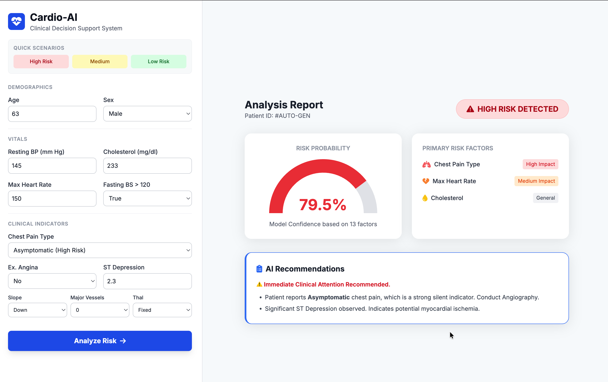
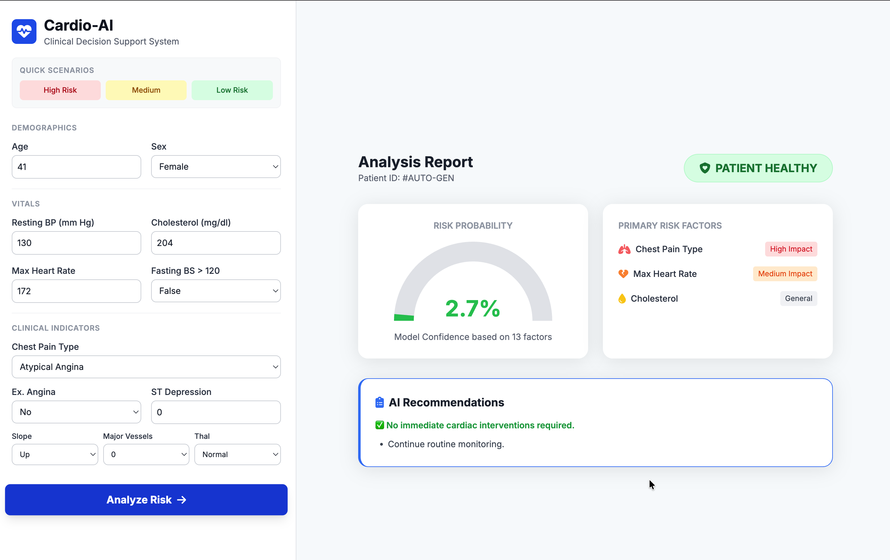

# BITS Group 120 | MLops

## Heart Disease Risk Prediction: End-to-End MLOps System

An industrial-grade MLOps project that automates the training, testing, and tracking of a Logistic Regression model to predict heart disease risk. This pipeline integrates data from 4 major international databases (Cleveland, Hungary, Switzerland, Long Beach VA) to create a robust, generalized prediction model.

### Key Features

Automated CI/CD: GitHub Actions triggers a full training & testing run on every push, ensuring code integrity.

Experiment Tracking: MLflow logs every run's parameters (C, solver), metrics (Accuracy, ROC-AUC), and artifacts (Confusion Matrix, ROC Curve).

Reproducibility: Strict requirements.txt and fixed random seeds ensure identical results across environments (Colab, Local, CI).

Robust Testing: Pytest suite verifies data integrity, model output ranges, and pipeline structure.

Data Aggregation: Merges 4 datasets to increase sample size from 303 (standard) to 920 patients.

### Tech Stack

1. Model: Scikit-Learn (Logistic Regression Pipeline with Scaling & Encoding)

2. Tracking: MLflow

3. Automation: GitHub Actions

4. Language: Python 3.10

5. Testing: Pytest & Flake8

```
├── .github/
│   └── workflows/              # CI/CD configuration (YAML)
├── data/
│   ├── 01_raw/                 # Original UCI files
│   ├── 02_processed/           # Merged & cleaned CSVs
│   └── 03_model_input/         # Train/Test split CSVs
├── mlruns/                     # Local MLflow logs (metrics & artifacts)
├── notebooks/
│   ├── 01_data_acquisition.ipynb
│   ├── 02_eda.ipynb
│   ├── 03_feature_engineering.ipynb
│   └── 04_model_experiments.ipynb
├── tests/                      # Pytest unit tests
├── train.py                    # Training script for automation
├── predict.py                  # Inference script for end users
└── requirements.txt            # Pinned dependencies


```

## How to Run Locally

1. Clone the Repo : 
`
git clone https://github.com/Mathi27/end-to-end-cardio-pipeline.git
`
2. Install Dependencies :
`pip install -r requirements.txt`

3. Train the Model : 
   

4. Run Inference (Predict) : 


- Output:
`
🔄 Loading model from Run ID: ...
✅ Result: HIGH RISK DETECTED (Probability: 82.4%)
`

5. Run Tests : 
`
pytest
`

## Model Performance: 

We benchmarked Logistic Regression against Random Forest using Stratified 5-Fold Cross-Validation.
| <selection-tag>Model | Test ROC-AUC | Test Accuracy | Verdict | 
 | ----- | ----- | ----- | ----- | 
| **Logistic Regression** | **0.911** | **83.2%** | **🏆 Selected** (Better generalization) | 
| Random Forest | 0.877 | 81.0% | Slightly overfit to noise</selection-tag> |

Medical Insight: The superior performance of the linear model suggests that heart disease risk factors (like Age, Max Heart Rate, and Cholesterol) have a strong additive relationship in this population.

## Medical Interpretability :

Our analysis confirmed critical cardiological markers, ensuring the model is "White Box" and interpretable by doctors:

Asymptomatic Chest Pain (cp=4): The single strongest predictor of disease presence.

Max Heart Rate (thalach): Shows a strong negative correlation. Patients unable to achieve high heart rates during stress tests are at significant risk.

ST Depression (oldpeak): A critical EKG marker indicating oxygen deprivation during exercise.


## Web Dashboard

| High Risk Patient | Low Risk Patient |
|------------------|-----------------|
|  |  |
